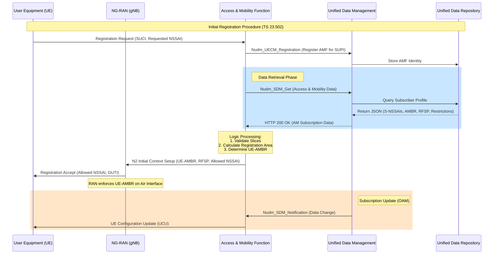

# 3GPP Technical Reference: UDM-AMF Subscription Management

This document provides a technical analysis of subscriber data stored in the Unified Data Management (UDM) and the granular logic applied by the Access and Mobility Management Function (AMF) to manage, enforce, and utilize this data in the 5G Core (5GC).

---

## 1. Exhaustive UDM Subscription Data Catalog

The UDM acts as the Stage 3 protocol front-end for subscriber data, persisting it in the Unified Data Repository (UDR). Data is structured into specific models defined in **TS 29.503**.

### 1.1 Access and Mobility Subscription Data (AM Data)
This is the primary data set used by the AMF to manage a UE's presence in the network.
*Reference: TS 29.503 Section 6.1.6.2.2 (Schema: `AccessAndMobilitySubscriptionData`)*

| Attribute Name | Technical Description | Functional Purpose (The "Why") |
| :--- | :--- | :--- |
| `supportedFeatures` | Features supported by the UDM for this subscriber. | Ensures compatibility between AMF and UDM capabilities. |
| `gpsis` | Generic Public Subscription Identifiers (MSISDN, External ID). | Public identities used for routing and identification by external AFs. |
| `internalGroupIds` | List of Internal Group Identifiers. | Allows AMF to apply policies or tracing to a specific group of UEs. |
| `subscribedSnsais` | List of S-NSSAIs (Slice ID) the user is allowed to access. | **Mandatory Enforcement:** AMF uses this to validate UE's requested slices during Registration. |
| `nssaiInclusionAllowed` | Boolean indicating if NSSAI can be included in cleartext. | Privacy control for slice information over the air interface. |
| `expectedUeBehaviour` | Predicted mobility patterns (e.g., stationary, periodic). | Used by AMF to optimize paging and power saving (PSM/eDRX) timers. |
| `primaryRatAccessRestriction` | Restrictions on RATs like NR, E-UTRA. | Prevents UE from camping on unauthorized radio technologies. |
| `secondaryRatAccessRestriction`| Restrictions on secondary RATs (e.g., for Dual Connectivity). | Controls Non-Standalone (NSA) or Multi-RAT access. |
| `roamingRestriction` | PLMNs where roaming is forbidden. | Enforces inter-operator service agreements at the AMF. |
| `ueAmbr` | Aggregate Max Bit Rate (uplink/downlink). | **Enforcement:** AMF provides this to the gNB to cap total user throughput. |
| `rfspIndex` | RAT/Frequency Selection Priority Index. | Influences gNB's RRM (Radio Resource Management) for idle/active mode mobility. |
| `periodicRegistrationTimer` | T3512 equivalent for 5GS. | Controls how often the UE must "check-in" with the AMF to maintain registration. |

### 1.2 Session Management Subscription Data (SM Data)
Used by AMF for SMF selection and by SMF for session establishment.
*Reference: TS 29.503 Section 6.1.6.2.4 (Schema: `SessionManagementSubscriptionData`)*

| Attribute Name | Technical Description | Functional Purpose |
| :--- | :--- | :--- |
| `singleNssai` | The specific S-NSSAI this SM data applies to. | Links session parameters to a specific network slice. |
| `dnnConfigurations` | Map of DNNs (e.g., "internet", "ims") allowed. | **AMF Logic:** AMF checks this to select the correct SMF for the requested DNN. |
| `internalGroupIds` | Group IDs specific to session management. | Used for group-based QoS or charging. |

---

## 2. AMF Functional Logic: The "How" and "Why"

### 2.1 Retrieval Mechanism (The "How")
The AMF retrieves data through the **Service-Based Architecture (SBI)** using the `Nudm_SubscriberDataManagement` (SDM) service.

1.  **Registration Trigger:** During the `Initial Registration` or `Mobility Registration Update` (TS 23.502, Section 4.2.2.2), the AMF invokes:
    *   **Service:** `Nudm_SDM_Get`
    *   **Resource URI:** `.../nnrf-nfm/v1/subscriptions/{supi}/am-data`
2.  **Selection Logic:** The AMF selects the UDM instance based on the subscriber's **SUPI** (Subscription Permanent Identifier) or **Internal Group ID** via the NRF (Network Repository Function).
3.  **Context Storage:** The AMF stores this data in the `UE Context` (TS 23.501, Section 5.2.2) while the UE is `RM-REGISTERED`.

### 2.2 Data Processing & Enforcement (The "What" and "Why")
| Data Item | AMF Action | Technical Reason (Why) |
| :--- | :--- | :--- |
| **Subscribed S-NSSAIs** | Validates `Requested NSSAI` from UE. | Ensures the UE only accesses authorized network slices. |
| **Mobility Restrictions** | Calculates `Registration Area` (List of TAs). | Limits UE movement to approved geographic areas (Tracking Areas). |
| **UE-AMBR** | Sent to NG-RAN via `N2 Context Setup`. | The RAN enforces the physical layer bitrate limit based on this value. |
| **RFSP Index** | Sent to NG-RAN. | Directs the RAN to prioritize specific frequencies (e.g., 3.5GHz vs 700MHz) for that user. |
| **Access Restrictions** | Rejects registration if UE camps on forbidden RAT. | Enforces subscription-level access control (e.g., 5G-only plans). |

---

## 3. Subscription Data Flow Chart

The following diagram illustrates the lifecycle of subscription data from UDM to AMF and its subsequent enforcement at the RAN.

---

## 4. Summary of Managed Parameters (Granular Reference)

| Parameter | Managed By | TS Reference | Page (Approx) |
| :--- | :--- | :--- | :--- |
| **SUPI / SUCI** | UDM/AMF | TS 23.501, 5.9 | 185 |
| **Subscribed S-NSSAI**| UDM | TS 23.501, 5.15.2 | 210 |
| **Allowed NSSAI** | AMF | TS 23.501, 5.15.4 | 215 |
| **UE-AMBR** | AMF/RAN | TS 23.501, 5.7.2.6 | 165 |
| **RFSP Index** | AMF/RAN | TS 23.501, 5.3.4.3 | 110 |
| **Registration Area** | AMF | TS 23.501, 5.3.2.3 | 105 |

---
### References
- **3GPP TS 23.501 V20.1.0**: System Architecture for the 5G System.
- **3GPP TS 23.502 V20.1.0**: Procedures for the 5G System.
- **3GPP TS 29.503 V19.6.0**: Unified Data Management Services (Stage 3).

*Last updated: May 2026*
