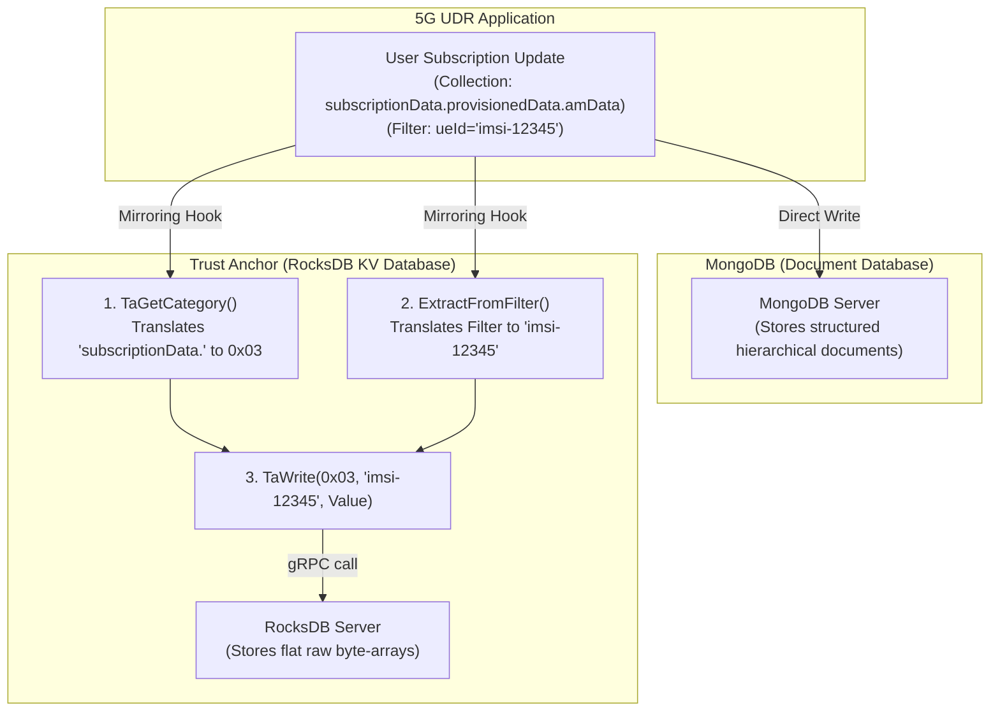

# Visualizing Database Storage: MongoDB vs. RocksDB (Trust Anchor)

This guide helps visualize how data is structured and stored in **MongoDB** (used natively by free5gc UDR) compared to **RocksDB** (used by the Trust Anchor).

---

## 1. High-Level Architectural Flow

When UDR performs a database operation, it mirrors the write. Here is how a single update flows into both databases concurrently:



---

## 2. Key Differences in Storage Concepts

Here is a side-by-side comparison of the core storage models:

| Feature | MongoDB (UDR) | RocksDB (Trust Anchor) |
| :--- | :--- | :--- |
| **Model Type** | **Document-oriented** database. | **Key-Value** store. |
| **Storage Unit** | BSON (Binary JSON) documents. | Raw byte slices (`[]byte`) for keys and values. |
| **Namespace Structure** | Hierarchical: **Databases** contain **Collections** containing **Documents**. | Flat: A single sorted table of byte arrays separated by **Category** prefixes. |
| **Lookup Method** | Complex query filters (e.g. search by name, date, nested properties). | Fast point lookup (find exact key). |
| **Indexing** | Multiple indexes can be created on any fields or subfields. | One index only: The sorted primary Key. |

---

## 3. Storage Layout Comparison (Concrete Example)

Assume we are saving subscription data for a user with `ueId = "imsi-12345"`.

### A. How it is stored in MongoDB
MongoDB keeps the structure intact. It parses the fields and knows that `gpsis` is an array and `amfSubscriptionInfo` is a nested object.

* **Collection Name**: `subscriptionData.provisionedData.amData`
* **Document**:
```json
{
  "_id": "60c72b2f9b1d8a2b3c4d5e6f",
  "ueId": "imsi-12345",
  "gpsis": ["msisdn-12345"],
  "amfSubscriptionInfo": {
    "amfInstanceId": "uuid-999aa",
    "plmnId": "20893"
  }
}
```

### B. How it is stored in RocksDB (Trust Anchor)
RocksDB has no concept of fields, structures, or databases. It only sees a flat lookup table of byte arrays. We combine the metadata into a single composite key.

* **Category (Namespace)**: `0x03` (represented as a single byte)
* **Key (Label)**: `"imsi-12345"` (represented as the byte slice of characters)
* **Value (Payload)**: `{"ueId":"imsi-12345","gpsis":["msisdn-12345"],"amfSubscriptionInfo":{...}}` (Serialized raw JSON bytes)

Here is a conceptual look at the RocksDB table:

| Memory Address / Index (Key) | Data Payload (Value) |
| :--- | :--- |
| **`0x03`** + **`"imsi-12345"`** | `[]byte(` `{"ueId":"imsi-12345","gpsis":["msisdn-12345"],...}` `)` |
| **`0x03`** + **`"imsi-67890"`** | `[]byte(` `{"ueId":"imsi-67890","gpsis":["msisdn-67890"],...}` `)` |

---

## 4. Visualizing the Key Transformation (The "Clerk" analogy)

Since the Trust Anchor only takes simple flat keys, `ExtractFromFilter` is the clerk that turns MongoDB search cards into flat labels:

```
[ MongoDB Filter Map ]                                      [ RocksDB Flat Key ]
{                                                           
   "ueId": "imsi-12345",         ==> ExtractFromFilter() ==>  "imsi-12345_20893"
   "servingPlmnId": "20893"                                  
}
```

> [!TIP]
> **Why do we concatenate keys (e.g. `"imsi-12345_20893"`)?**
> If a single subscriber has multiple profile records in different PLMNs, storing them under just `"imsi-12345"` would cause the second PLMN record to overwrite the first. By appending the PLMN ID to the key, we guarantee that each record gets its own unique slot in RocksDB.
