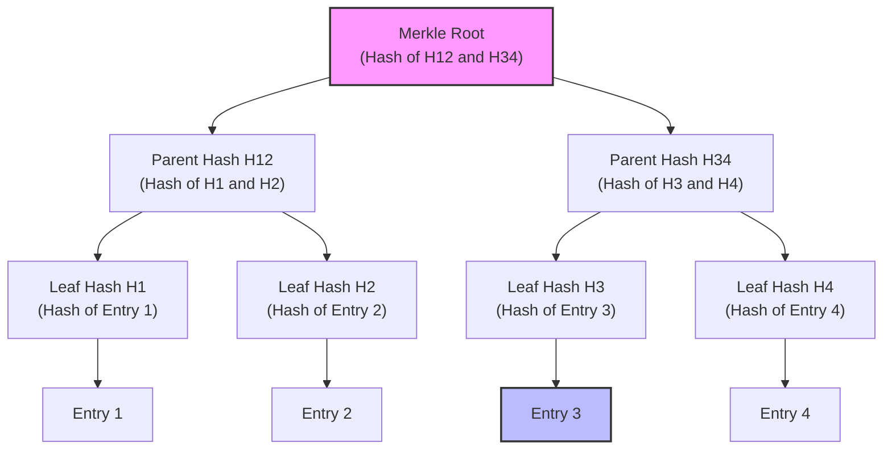
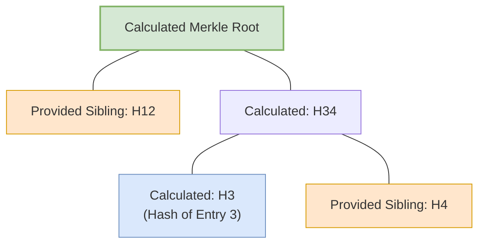

# Understanding Merkle Trees: A Beginner's Guide

If you are new to cryptography, blockchain, or verifiable databases (like the Trust Anchor), you might have heard the term **Merkle Tree**. 

This guide is designed for beginners. If you have basic experience in C programming and zero experience with cryptography, this document will help you understand what a Merkle Tree is, how it works, and why it is so powerful.

---

## 1. The Foundation: Cryptographic Hashing

Before looking at the tree structure, we must understand the build block: **Hashing**.

Think of a cryptographic hash function as a **digital fingerprint generator**. You feed any amount of data (a word, a file, or a whole database) into the hash function, and it outputs a fixed-length string of bytes (the "hash").

### The Rules of Hashing:
1. **Deterministic:** The same input will *always* produce the exact same hash.
2. **One-Way:** You cannot reverse-engineer the original data from its hash.
3. **Collision Resistant:** It is practically impossible to find two different inputs that produce the same hash.
4. **Avalanche Effect:** Changing even **one letter** or **one bit** in the input changes the resulting hash completely.

### Hashing in C:
If you were writing this in C, a simple hash function signature might look like this:
```c
// Takes input data of any length, and writes a fixed 32-byte hash to hash_out
void sha256(const uint8_t *data, size_t len, uint8_t *hash_out);
```

---

## 2. The Problem: How Do We Verify Data Efficiently?

Imagine you have a list of **8 database entries** containing subscriber profiles:
`[Entry 1, Entry 2, Entry 3, Entry 4, Entry 5, Entry 6, Entry 7, Entry 8]`

You store these profiles on an untrusted cloud server. Later, you retrieve **Entry 3**. How do you prove that the server didn't tamper with or modify **Entry 3**?

### The Inefficient Ways:
* **Option A:** Download all 8 entries and check them. (Very slow if you have millions of entries).
* **Option B:** Calculate a single hash of all 8 entries concatenated together. To verify **Entry 3**, you still have to download the other 7 entries to re-calculate the combined hash.

### The Merkle Tree Solution:
A Merkle Tree allows you to verify that **Entry 3** is correct and untampered with by downloading only **3 small hashes** instead of all the other records.

---

## 3. How a Merkle Tree is Built

A Merkle Tree is a binary tree built from the bottom up by hashing pairs of nodes.

1. **Leaf Nodes:** First, we hash each database entry individually.
2. **Intermediate Nodes:** We pair up adjacent hashes, combine them, and hash the combination.
3. **The Root Hash:** We repeat this process up the tree until only one hash remains at the top. This top hash is called the **Merkle Root**.

Here is how the tree looks visually:



* The **Merkle Root** is a single 32-byte fingerprint representing the **entire state** of all data below it. If any record (e.g., Entry 3) is altered, its leaf hash ($H_3$) changes, which changes $H_{34}$, which ultimately changes the **Merkle Root**.

---

## 4. How to Prove a Record Exists (Inclusion Proofs)

Suppose the client (UDR) has the trusted **Merkle Root** stored locally. The server holds the actual database.
The server wants to send **Entry 3** to UDR and prove it hasn't been altered.

Instead of sending the whole database, the server only sends:
1. The target data: **Entry 3**
2. An **Inclusion Proof** containing the sibling hashes: `[H4, H12]`

### How the UDR Verifies the Proof:
1. UDR hashes **Entry 3** to calculate **$H_3$**.
2. UDR combines the calculated **$H_3$** with the provided sibling **$H_4$** to calculate **$H_{34}$**.
3. UDR combines the calculated **$H_{34}$** with the provided sibling **$H_{12}$** to calculate the **Merkle Root**.
4. UDR compares this calculated root with its trusted local **Merkle Root**. If they match, the data is guaranteed to be authentic!



### The Efficiency Gain:
For a database with $N$ entries, the number of hashes needed for proof is $\log_2(N)$.
* If your database has **1,000,000 entries**, you only need **20 hashes** to prove any entry exists!

---

## 5. C-style Pseudocode Representation

To see how this maps to data structures, here is how you might represent these concepts in C:

```c
#include <stdio.h>
#include <string.h>
#include <stdint.h>

// Represents a single 32-byte SHA-256 hash node
typedef struct {
    uint8_t bytes[32];
} MerkleHash;

// Mock hash function
void sha256(const uint8_t *data, size_t len, uint8_t *hash_out) {
    // In a real implementation, this would compute a real SHA-256 hash.
    // For this example, we mock it by copying/zeroing bytes.
    memset(hash_out, 0, 32);
    memcpy(hash_out, data, len > 32 ? 32 : len);
}

// Combines two child hashes to form a parent hash
void compute_parent_hash(const MerkleHash *left, const MerkleHash *right, MerkleHash *parent_out) {
    uint8_t combined[64];
    
    // Concatenate left hash and right hash (32 bytes + 32 bytes = 64 bytes)
    memcpy(combined, left->bytes, 32);
    memcpy(&combined[32], right->bytes, 32);
    
    // Hash the combined 64 bytes to produce the parent hash
    sha256(combined, 64, parent_out->bytes);
}

// Simple test structure
int main() {
    MerkleHash h1, h2, parent;
    
    // Initialize dummy hashes
    memset(h1.bytes, 0xAA, 32);
    memset(h2.bytes, 0xBB, 32);
    
    // Compute parent
    compute_parent_hash(&h1, &h2, &parent);
    
    printf("Parent Hash generated successfully.\n");
    return 0;
}
```

---

## 6. Relevance to Trust Anchor
The Trust Anchor database stores the logs of all mutations inside a Merkle Tree Audit Log. When UDR or other client components read subscription profiles, they can request the inclusion proof (`ProofEntry` in the protobuf) from the Trust Anchor, verify it against the log root, and prove that the records have not been maliciously modified by any administrator or external threat.
